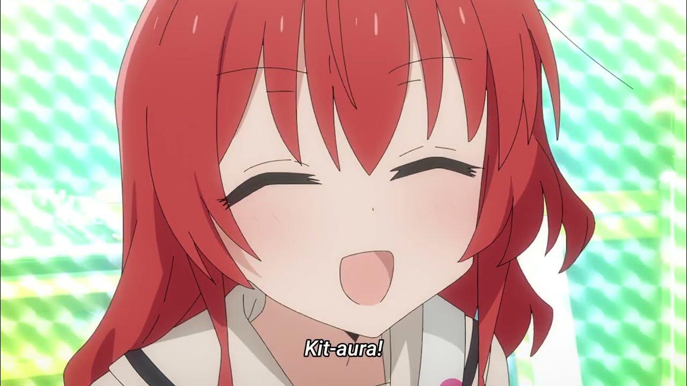

# KITA

キターン

## TODO

- [x] Raycasting renderer
- [x] Sprite renderer
- [x] Tiled map and tilset parser
- [x] Better input system
- [x] Mouse screen rotation
- [x] Player movement
- [x] Player collision
- [ ] Entity system
- [ ] Tiled entity loading
- [ ] Projectile shooting
- [ ] Scan hit shooting
- [ ] Basic enemy AI
- [ ] Health system
- [ ] Particle system
- [ ] Level transitions
- [x] Text rendering

## Other cool stuff maybe

- [?] Experimenting with complex AI
- [?] Multiplyer
- [?] Inventory
